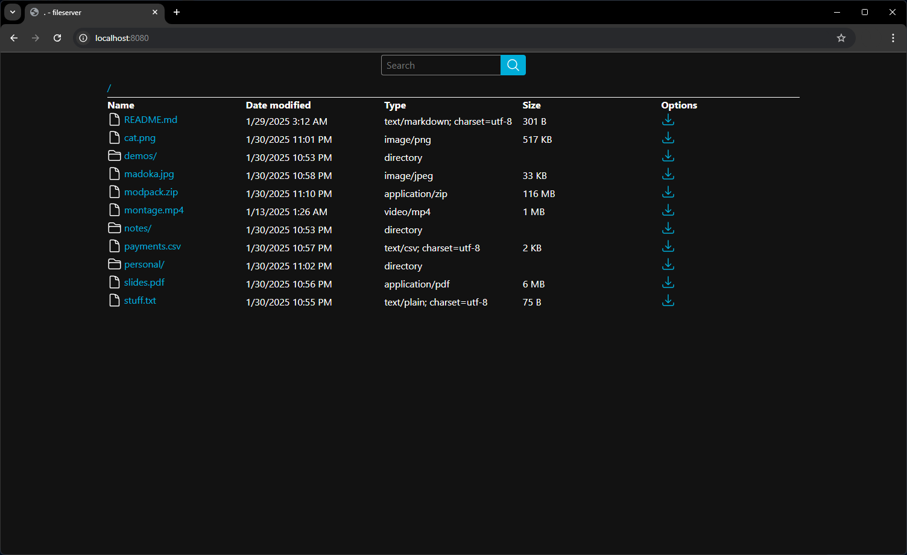

# Go Fileserver

[](https://github.com/Ke126/fileserver/actions/workflows/push-ghcr.yaml)



A minimalist fileserver implementation, written in Go with zero external dependencies. Currently supports file viewing, file download, zip download, and recursive search, with many more features planned for the future.

## How to use

### As a Go package

```bash
go get github.com/ke126/fileserver
```

```go
http.Handle("/", fileserver.FileServer(fileserver.NewFS("."), slog.Default()))
```

### As a Docker image

```bash
docker pull ghcr.io/ke126/fileserver:latest
docker run -p 8080:8080 -v $(LOCAL_DIR):/content ghcr.io/ke126/fileserver:latest
```

The fileserver container is configured to serve content from the container directory `/content`. Make sure to provide a volume mapping in order to serve whatever files you would like.

## Todo

This project is still a heavy work in progress. Planned future additions include:

- [ ] Upload, move, rename, and delete files (after [Go 1.24](https://tip.golang.org/doc/go1.24#directory-limited-filesystem-access) comes out)
- [ ] Glob and fuzzy search
- [ ] Download directories as .tar.gz archives
- [ ] HTTP Basic authentication
- [ ] Encryption at rest
- [ ] File preview
